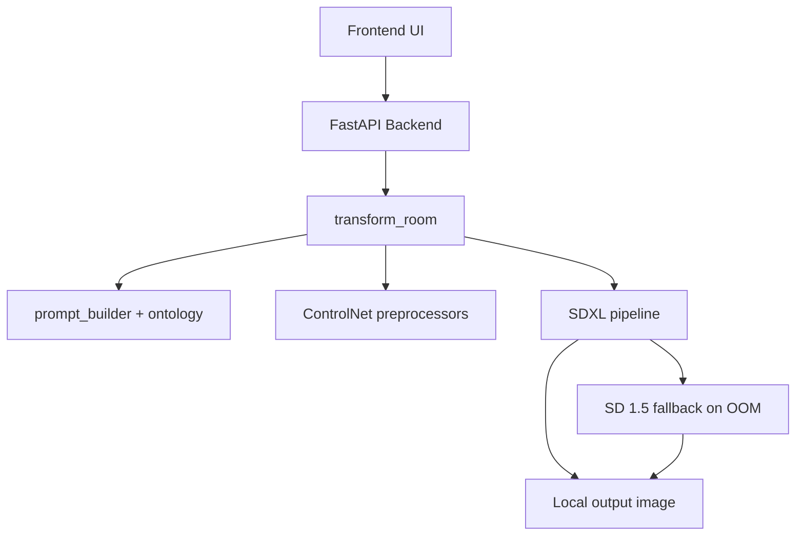

# DarDesign Architecture

## Core Modules

- `backend/main.py`: API endpoints and job lifecycle
- `backend/transform.py`: local inference pipeline, LoRA loading, fallback behavior
- `backend/prompt_builder.py`: bilingual prompt generation from ontology
- `backend/settings.py`: centralized local directories, hardware detection, logging
- `scripts/train_lora.py`: local training entry point
- `scripts/*.py`: local sweep/finals/ablation/metrics workflows

## Local Storage

- Data root (default): `data/`
- Raw inputs: `data/raw/`
- Processed data: `data/processed/`
- Models: `data/models/` and `models/loras/`
- Cache: `data/cache/`
- Exports: `data/exports/`
- Temp: `data/temp/`
- Checkpoints: `data/checkpoints/`
- Logs: `logs/`

## Runtime Behavior

- Hardware auto-detection picks CUDA when available, CPU otherwise.
- 8 GB GPU-safe defaults are automatically applied.
- Inference and training metrics are logged to local log files.
- All pipeline outputs and artifacts are written to local directories.
