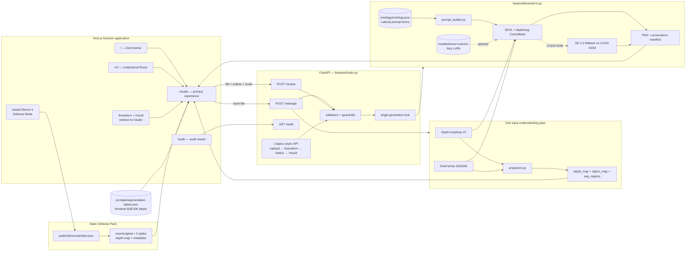
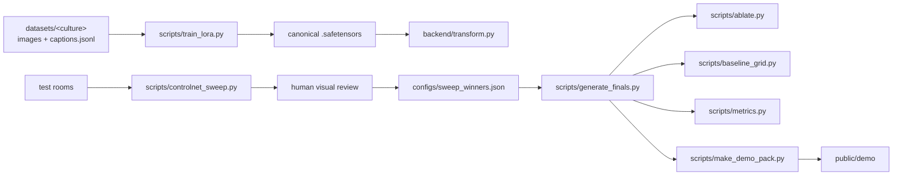

# DarDesign architecture

DarDesign has one Next.js frontend, one FastAPI backend, and one canonical
inference pipeline. Local LIGHT mode and Kaggle GPU mode use the same API
contracts; only the generation implementation changes.

## Runtime flow

The primary `/redesign` request is synchronous from the client's perspective,
but the server streams whitespace keepalives before the final JSON so long T4
renders survive proxy first-byte timeouts. GPU work across `/redesign`,
`/restyle`, and the legacy flow is serialized because the cached Diffusers
pipeline and LoRA hot-swap state are not concurrency-safe.

## Public routes and API contracts

### Frontend routes

| Route | Behavior |
|---|---|
| `/` | Cinematic landing page and entry to the studio |
| `/studio` | Upload one room, request all three core redesigns, and explore results |
| `/studio?demo=1` | Load the static demo manifest and room assets without FastAPI |
| `/v2` | Alternate “The Understood Room” storytelling experience |
| `/audit` | Unlinked administration view of metadata-only render events |
| `/atelier.html` | Preserved standalone static design reference |
| `/transform`, `/result` | Permanent application redirects to `/studio` |

### Primary FastAPI surface

| Endpoint | Input | Output |
|---|---|---|
| `GET /healthz` | none | mode, version, and queue health |
| `POST /redesign` | multipart `file` | `original`, `lebanese`, `khaleeji`, and `moroccan` PNG data URLs plus optional `object_map`, `seg_regions`, and `depth_map` |
| `POST /restyle` | multipart `file`, `style`, `scale` | one PNG data URL, clamped scale, style, and optional provenance manifest |
| `GET /audit` | optional `limit` and `token` | newest metadata-only render events |

The legacy asynchronous contract remains supported for existing clients:
`POST /upload`, `POST /transform`, `GET /status/{job_id}`,
`GET /result/{job_id}`, `POST /retry/{job_id}`,
`GET /share-token/{job_id}`, and `GET /share/{token}`.

Validation is shared: supported image MIME/format, a 10 MB cap, a minimum
256-pixel dimension, style validation, prompt-fragment sanitization, and
server-side ControlNet-weight clamping. Errors use bilingual
`{code, message_en, message_ar}` payloads.

## Subsystem responsibilities

| Subsystem | Responsibility |
|---|---|
| `src/app` | Route composition and the live/Defense Mode user flows |
| `src/lib/api.ts` | Typed client, timeouts, abort handling, response validation, and bilingual API errors |
| `backend/main.py` | Stable HTTP contracts, upload persistence, job coordination, audit calls, and generation locking |
| `backend/transform.py` | Canonical LIGHT/SDXL pipeline, ControlNets, LoRA lifecycle, and OOM fallback |
| `backend/projection.py` | Convert one depth/segmentation pass into normalized map and highlight payloads |
| `backend/prompt_builder.py` | Build seeded bilingual prompts from the cultural ontology |
| `ontology/ontology.json` | Culture triggers and seven categories of weighted bilingual design vocabulary |
| `src/data/segmentation-labels.json` | ADE20K class labels and notes for browser visualizations; not the prompt ontology |
| `scripts` | Training, sweeps, final generation, ablations, baselines, demo packing, and metrics |

## Model and data lifecycle

Raw images, captions, model weights, generated outputs, audit events, and the
Defense Mode pack are local artifacts rather than Git-tracked source. The
repository keeps schemas, dataset guidance, scripts, and canonical output
locations so every artifact can be reproduced.

## Design decisions

1. **One pipeline, two execution modes.** `DARDESIGN_LIGHT=1` returns explicit
   placeholders without importing the heavy ML stack. GPU mode uses the same
   functions and response shapes.
2. **Three stable core styles.** `/redesign` always returns Lebanese,
   Khaleeji, and Moroccan fields. Persian stays prompt-only on `/restyle`, so
   it demonstrates extensibility without changing the flagship contract or
   tripling demo time.
3. **One understanding pass.** Depth and semantic segmentation are reused for
   generation controls, the 2D room map, on-image regions, and the depth orbit.
   A projection failure removes those optional views but does not discard
   completed redesigns.
4. **Lazy LoRA with prompt-only fallback.** A missing canonical weight logs a
   warning and generation continues from the cultural prompt.
5. **Defense Mode is same-origin and backend-free.** Static rooms exercise the
   full result storytelling path without depending on a live T4 or tunnel.
6. **Audit images are never stored in the log.** `backend/audit.jsonl`
   contains event metadata only and can be token-gated through
   `DARDESIGN_AUDIT_TOKEN`.
